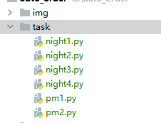

# auto_order

#### 介绍
一个简单的脚本案例

#### 软件架构
- 基于Python3
- img 用于存储结果图片
- task 用于创建自己的约场任务
- main.py 核心程序
- send_email.py 发送邮件模块

#### 安装教程

1. 根据自己的chrome浏览器配置好chromedriver下载程序目录下
2. pip install -r requirements.txt

#### 使用说明

1. 在main文件中配置规划好一周七天的约场账号和约场任务
2. 在main中配置好约场优先级顺序
3. 在main中配置好邮件模块
4. 这个版本的脚本一个任务只能约一个场，如果有需要约多个场，需要创建多个脚本同时运行， 
   并且保证每个脚本使用的账号不冲突即可。类似如下
   

#### auto_order类参数含义
1.可选参数：
- display： 是否显示约场过程 默认为false
- send_img: 是否发送图片 默认为false
- email: 邮箱模块，默认为None，使用配置好的邮箱模块则可以发送邮件

#### 建议
1. 可以使用windows定时任务设置开始约场前20秒启动
2. 可以同时设置多个定时任务，一个定时任务对应一个文件，一组账号，一个约场任务。
